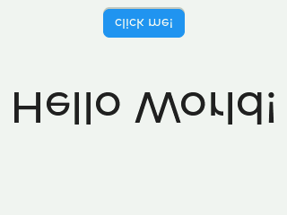

# wokwi reproducibles

## issue: mirrored screenshots from test scenarios

images downloaded from scenarios are upside down and mirrored:

| `tests/test_touch.yaml` | `tests/test_touch.py` |
| :-: | :-: |
|  | 

however, issuing a `touch` command only succeeds in the automation scenario and not the python scenario - despite
using identical coordinates.

if running the firmware locally via the wokwi simulator, you can note your touch coordinates by looking for a line
like `touched: x: 150, y: 210` in the terminal.

upon clicking the button, the terminal should output `app: button clicked!`

### how to build

- `idf.py set-target esp32s3`
- `idf.py build`

### how to test

- `pip install -r requirements.txt`
- `pytest -s tests/`
- `wokwi-cli --scenario tests/test_touch.yaml`

OR

- `just test`
- `just ww-test`